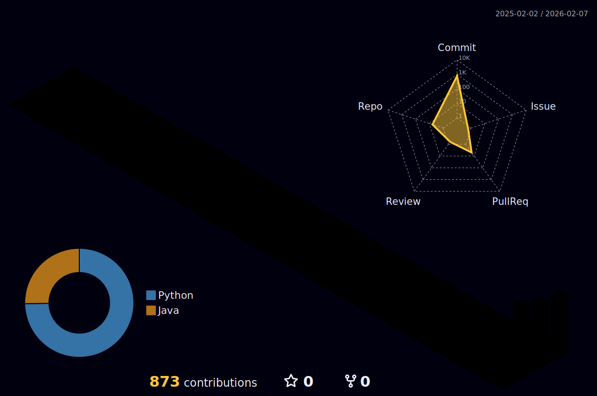

# ☁️ Haneul

  

## 🎓 Introduction

## Experience
---
Republic of Korea Army | First Lieutenant
Mar 2019 – Jun 2021
Key Achievement: Developed an Excel-based daily dry-fire training program to digitize and streamline military drill management.
---
Math Academy | Team Leader / Instructor
Jul 2021 – Dec 2025
Team Leader (Oct 2023 – Dec 2025): Managed academy operations and led the teaching team.
Instructor (Jul 2021 – May 2023): Delivered mathematics curriculum to students, focusing on core concepts and exam preparation.
Key Achievement: Planned, developed, and operated a comprehensive Academy Management System using Google Sheets and Google Apps Script, significantly improving administrative efficiency.
---
Education & Training
SSAFY (Samsung Software Academy for Youth) | 15th Cohort
Jan 2026 – Present
Location: Gumi Campus
Track: Python Track
Intensive software engineering fellowship focused on full-stack development and algorithm problem-solving using Python.

---

## 🛠 Tech Stack

  

---

 

---
## 🌌 My Grass Garden

---

## 🐍 Snake Eating My Contributions
<picture>
  <source media="(prefers-color-scheme: dark)" srcset="https://raw.githubusercontent.com/hj0543/CodeHaneul/output/github-snake-dark.svg">
  
</picture>

---

### 📫 Contact Me

